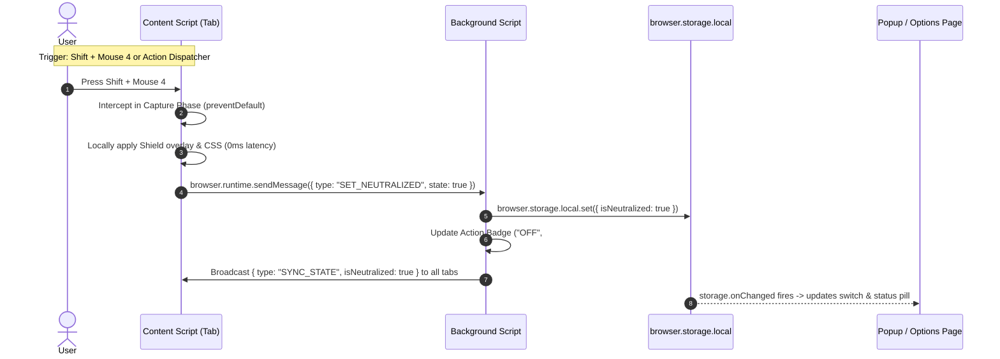
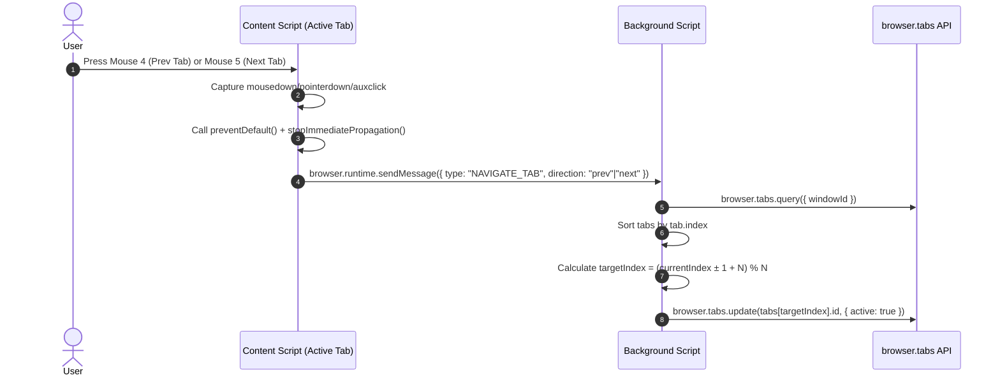

# HDCursor: Technical Architecture & Developer Context

This document is a technical reference and architecture specification for **HDCursor** (Phantom Cursor & Navigation Controller), written specifically for future AI iterations, core maintainers, and extension engineers.

---

## 1. System Architecture & Component Communication

HDCursor operates across four distinct extension execution contexts under **Firefox Manifest V3**:
1. **Isolated Content Scripts** (`content/content.js`)
2. **Background Event Script** (`background/background.js`)
3. **Popup Interface** (`popup/popup.js`)
4. **Options Dashboard & Recorder** (`options/options.js`)

All contexts communicate through the WebExtension Storage API (`browser.storage.local`) as the source of truth, complemented by low-latency cross-context messaging (`browser.runtime.sendMessage` and `browser.tabs.sendMessage`).

### 1.1 Communication & State Synchronization Flow



### 1.2 Tab Navigation Flow



---

## 2. Low-Level Mechanics: Event Interception & Shield Injection

### 2.1 The Two-Layer Neutralizer Shield

Neutralizing web cursor interactions while preserving keyboard interaction requires a two-layer defense:

```
+-------------------------------------------------------------+
| LAYER 1: Shadow DOM Neutralizer Overlay                     |
| Tag: <hdcursor-shield> (z-index: 2147483647, cursor: none)  |
| - Absorbs pointer movements, clicks, drags                   |
| - Prevents underlying DOM elements from receiving :hover    |
| - user-select: none, pointer-events: all                     |
| - tabindex: -1 (does NOT capture or steal keyboard focus)    |
+-------------------------------------------------------------+
| LAYER 2: Global CSS Injection                               |
| Dynamic <style>: * { cursor: none !important; }             |
| - Enforces cursor invisibility even during edge reflows     |
| - Applied at document_start to document.documentElement     |
+-------------------------------------------------------------+
| PAGE CONTENT (DOM)                                          |
| - Keyboard events (keydown, keyup, text input) bubble       |
|   freely to document & active focused inputs                |
+-------------------------------------------------------------+
```

1. **Layer 1: The Shadow DOM Shield Overlay (`<hdcursor-shield>`)**:
   - Injected into `document.documentElement` at `document_start`.
   - Encapsulated within an open Shadow DOM root. This isolates the overlay's internal styling so that hostile or overly broad page stylesheets (`!important` rules on `div`, etc.) cannot override its fixed positioning or transparent background.
   - Sets `pointer-events: all;` with `position: fixed; inset: 0; width: 100vw; height: 100vh; z-index: 2147483647;`.
   - Any physical mouse movement or click impacts the overlay surface instead of underlying links, buttons, or hover-reactive elements. Tooltips, popovers, and CSS `:hover` states never fire.
   - `tabindex="-1"` and `aria-hidden="true"` guarantee that screen readers and keyboard focus management (Tab navigation, typing into `<input>` or `<textarea>`) are completely unaffected.

2. **Layer 2: Dynamic CSS Override (`* { cursor: none !important; }`)**:
   - Injected directly into the document root via `<style id="hdcursor-injected-style">` and attribute selector `html[data-hdcursor-neutralized="true"]`.
   - Ensures that even if the host web application dynamically alters the cursor property via inline styles (e.g., `element.style.cursor = 'wait'`), the cursor remains invisible.

### 2.2 Preventing Default Browser History Navigation on Mouse 4 & Mouse 5

In Firefox on Windows and Linux, Mouse 4 (button index 3) triggers `History: Back` and Mouse 5 (button index 4) triggers `History: Forward`.

#### The Two-Tier Firefox Event Model
Understanding side mouse buttons in Firefox requires distinguishing between **OS-level Browser Chrome** and **DOM Content Execution**:

1. **Tier 1: OS-Level Native Window Procedure (`WM_APPCOMMAND` / `WM_XBUTTONUP`)**:
   - On Windows, physical button presses send hardware messages directly to the top-level application window handle (`HWND`).
   - By default, Firefox's C++ browser chrome listens for these messages. When enabled (`mousebutton.4th.enabled = true`), Firefox processes `BrowserBack()` and `BrowserForward()` directly in its native UI thread.
   - **Crucial Behavior**: In this state, Firefox consumes the hardware message at the OS level and **does not dispatch any DOM events** (`mousedown`, `pointerdown`, `auxclick`, or `mouseup`) to web pages or content scripts.

2. **Tier 2: DOM Event Pipeline (`auxclick`, `mousedown`, `pointerdown`)**:
   - When the native navigation binding is disabled (`mousebutton.4th.enabled = false` in `about:config`), Firefox releases the buttons to the DOM pipeline.
   - Firefox dispatches side buttons primarily as **`auxclick`** events (non-primary button clicks) along with `pointerdown`/`mousedown` depending on platform and input driver.

#### The Solution: Unified Capture Phase Dispatcher with Debouncing
To guarantee responsiveness across all platforms and configurations, HDCursor implements a unified event listener in `content/content.js`:

```javascript
// Register capture phase listeners on both window, document, and Shadow DOM root:
const captureOpts = { capture: true, passive: false };

[window, document].forEach(target => {
  target.addEventListener('pointerdown', handleMouseEvent, captureOpts);
  target.addEventListener('mousedown', handleMouseEvent, captureOpts);
  target.addEventListener('pointerup', handleMouseEvent, captureOpts);
  target.addEventListener('mouseup', handleMouseEvent, captureOpts);
  target.addEventListener('auxclick', handleMouseEvent, captureOpts);
  target.addEventListener('click', handleMouseEvent, captureOpts);
  target.addEventListener('contextmenu', handleMouseEvent, captureOpts);
  target.addEventListener('keydown', onKeyDown, captureOpts);
});
```

1. **Capture-Phase Execution**:
   - Intercepts `pointerdown`, `mousedown`, and `auxclick` before any host webpage script or default handler can act.
   - Invokes `dispatchMatchedAction(actionId, eventSource)` with a **250ms debouncing window**. This guarantees that whichever event arrives first executes the action immediately, while subsequent events within the same click gesture (e.g. `mousedown` following `pointerdown`, or `auxclick` following `mouseup`) do not trigger redundant actions.
2. **Default Action Suppression**:
   - `e.preventDefault()`, `e.stopPropagation()`, and `e.stopImmediatePropagation()` are called on all phases of the matched button click.
3. **Shadow DOM Direct Attachment**:
   - Event listeners are also directly attached to the `#glass` element inside the `<hdcursor-shield>` Shadow DOM, ensuring complete event capture when the neutralizer shield is actively engaged.

---

## 3. Storage Schema Specification

The extension uses `browser.storage.local` with the following schema:

```typescript
interface HDCursorStorageSchema {
  // Global shield state: true if cursor is neutralized
  isNeutralized: boolean;

  // Hardware Pointer Lock toggle (off by default)
  pointerLockEnabled: boolean;

  // Permit vertical/horizontal wheel scrolling while hover is blocked
  allowWheelScroll: boolean;

  // Action Keybinds mapping: actionId -> BindingDefinition
  bindings: Record<string, BindingDefinition>;

  // Schema version for future migrations
  version: number;
}

interface BindingDefinition {
  // Ordered modifier keys: any subset of ['Ctrl', 'Alt', 'Shift', 'Meta']
  modifiers: Array<'Ctrl' | 'Alt' | 'Shift' | 'Meta'>;

  // Trigger type
  triggerType: 'mouse' | 'keyboard';

  // Standard DOM Event code:
  // Mouse: 'MouseLeft' | 'MouseMiddle' | 'MouseRight' | 'Mouse4' | 'Mouse5'
  // Keyboard: 'KeyA' | 'Space' | 'ArrowLeft' | 'F8' | etc.
  triggerCode: string;

  // Mouse button index (0..4) or null for keyboard
  button: number | null;

  // Keyboard key value or null for mouse
  key: string | null;

  // Human-readable formatted string for display badges
  displayName: string;
}
```

### Signature Computation
Signatures are canonical strings used for collision detection and O(1) event matching:
```javascript
// Format: [Sorted Modifiers] + [TriggerCode]
// Examples:
"Shift+Mouse4"
"Mouse4"
"Mouse5"
"Ctrl+Alt+KeyK"
```
> **Implementation Note**: Signatures must always be generated via `getBindingSignature({ modifiers, triggerCode })` or `[...normalizeModifiers(mods), triggerCode].join('+')`. Avoid naive string concatenation (`mods.join('+') + '+' + triggerCode`) which produces invalid leading plus signs (`"+Mouse4"`) when `modifiers` is empty.

---

## 4. Step-by-Step Guide: Adding New Actions in Future Updates

Adding a new action (e.g., `duplicate_tab`, `close_tab`, `reload_tab`, or `toggle_lock`) requires four simple steps:

### Step 1: Register Action Definition in `shared/defaults.js`

Add the action definition to `ACTIONS`:

```javascript
// In shared/defaults.js -> ACTIONS:
duplicate_tab: {
  id: 'duplicate_tab',
  title: 'Duplicate Current Tab',
  description: 'Duplicate the active tab in the current window.',
  category: 'Navigation',
  defaultBinding: {
    modifiers: ['Ctrl', 'Shift'],
    triggerType: 'keyboard',
    triggerCode: 'KeyD',
    button: null,
    key: 'D',
    displayName: 'Ctrl + Shift + D'
  }
}
```

Also add it to `DEFAULT_SETTINGS.bindings`:
```javascript
bindings: {
  toggle_cursor: { ...ACTIONS.toggle_cursor.defaultBinding },
  prev_tab: { ...ACTIONS.prev_tab.defaultBinding },
  next_tab: { ...ACTIONS.next_tab.defaultBinding },
  duplicate_tab: { ...ACTIONS.duplicate_tab.defaultBinding }
}
```

### Step 2: Handle Action Execution in `content/content.js`

Add the case to `executeAction(actionId)`:

```javascript
// In content/content.js -> executeAction():
case 'duplicate_tab': {
  extApi.runtime.sendMessage({
    type: 'DUPLICATE_TAB'
  }).catch(err => console.debug('[HDCursor] Duplicate tab error:', err));
  break;
}
```

### Step 3: Implement Background Logic in `background/background.js`

Add the message handler to `background/background.js`:

```javascript
// In background/background.js -> onMessage listener:
case 'DUPLICATE_TAB': {
  const currentWindow = await extApi.windows.getCurrent();
  const tabs = await extApi.tabs.query({ windowId: currentWindow.id, active: true });
  if (tabs.length > 0) {
    await extApi.tabs.duplicate(tabs[0].id);
    return { success: true };
  }
  return { success: false, reason: 'No active tab found' };
}
```

### Step 4: UI Reflection
Because the Options page (`options/options.js`) dynamically iterates over `defaults.ACTIONS`, **the new action automatically appears in the settings table, becomes recordable via the Input Recorder, and is validated against conflicts with zero additional UI code required!**

---

## 5. Browser Quirks & Security Sandbox Limits

### 5.1 Restricted Pages (`about:*`, `addons.mozilla.org`)
- **Firefox Security Policy**: WebExtensions cannot inject content scripts into privileged URLs:
  - `about:*` (e.g., `about:debugging`, `about:config`, `about:addons`, `about:home`, `about:blank` without parent).
  - Mozilla Add-ons store (`addons.mozilla.org`).
- **Impact**: On these pages, content scripts cannot execute. Tab navigation shortcuts pressed while focused on an `about:*` tab will not be captured by the content script.
- **Handling**: In `background/background.js`, `broadcastState()` explicitly filters out `about:`, `chrome:`, and `moz-extension:` URLs to prevent unhandled rejection spam.

### 5.2 Firefox Pointer Lock API Security Banner
- When `document.documentElement.requestPointerLock()` is invoked, Firefox enforces a built-in security banner at the top of the window:
  ```
  [ "example.com has locked your mouse pointer. Press Esc to show your pointer." ]
  ```
- **Constraint**: This banner is an immutable browser security safeguard to prevent web applications or extensions from maliciously capturing user hardware control. It cannot be styled, relocated, or disabled via WebExtensions.
- **Design Decision**: Hardware Pointer Lock is configured as an optional, experimental toggle (off by default) with an explicit in-UI notice in both the Popup and Options pages informing users of this native banner.

### 5.3 User Gesture Requirement for Pointer Lock
- Browsers require a transient user activation (user gesture) to call `requestPointerLock()`.
- Because HDCursor triggers the lock in response to the user's physical keypress or mouse button click, the activation criteria are satisfied.

### 5.4 Cross-Platform Mouse Button Mappings
- `e.button = 0`: Primary / Left Click (`MouseLeft`)
- `e.button = 1`: Auxiliary / Middle Mouse Wheel Click (`MouseMiddle`)
- `e.button = 2`: Secondary / Right Click (`MouseRight`)
- `e.button = 3`: Browser Back / Side Button 4 (`Mouse4`)
- `e.button = 4`: Browser Forward / Side Button 5 (`Mouse5`)

### 5.5 Firefox Content Script Sandbox Scope (`globalThis` vs `window`)
- In Firefox, content scripts execute in an isolated `Sandbox` realm.
- In this realm, `globalThis` points to the extension sandbox global, while `window` is an Xray wrapper around the host page's DOM window.
- Shared libraries injected via `manifest.json`'s `content_scripts[].js` define properties on `globalThis` and `var` in the sandbox scope. Accessing `window.HDCursorDefaults` will yield `undefined` because `window` represents the webpage's window, not the sandbox global.
- HDCursor safely resolves globals using:
  ```javascript
  const defaults = (typeof HDCursorDefaults !== 'undefined' ? HDCursorDefaults : null) ||
    (typeof globalThis !== 'undefined' ? globalThis.HDCursorDefaults : null) ||
    (typeof window !== 'undefined' ? window.HDCursorDefaults : null);
  ```

### 5.6 Firefox Mouse Wheel `DOM_DELTA_LINE` & Nested Scroll Containers
- In Firefox on Windows and Linux, `WheelEvent.deltaMode` defaults to `1` (`DOM_DELTA_LINE`) where each wheel tick yields `deltaY = 3` (3 lines, not 3 pixels). Directly forwarding `deltaY` to `scrollBy()` causes imperceptible 3px micro-movements.
- HDCursor applies a line multiplier (`deltaY * 28`) when `deltaMode === 1`.
- **Nested Scroll Target Resolution via `document.elementsFromPoint(x, y)`**:
  - Naive implementations try temporarily setting `pointer-events: none` on `#glass` and calling `document.elementFromPoint()`. However, because the parent `<hdcursor-shield>` custom element itself has `pointer-events: all !important` in stylesheet cascade rules, `document.elementFromPoint()` consistently hits `<hdcursor-shield>` instead of underlying webpage nodes.
  - HDCursor resolves this using `document.elementsFromPoint(clientX, clientY)`. This inspects the entire rendering stack at the cursor coordinates, filters out `HDCURSOR-SHIELD`, and inspects each element's computed `overflowY`/`overflowX` and `scrollHeight > clientHeight` to find the true nested scroll container (e.g. YouTube feeds, video comments, modal dialogs, code blocks) with zero DOM style mutations, zero reflow, and zero flickering.

### 5.7 Operating System Level Side-Button Interception (`about:config`)
- By default on Windows, Firefox traps raw Mouse 4 and Mouse 5 before dispatching to the DOM.
- If users disable `mousebutton.4th.enabled = false` and `mousebutton.5th.enabled = false` in `about:config`, Firefox drops the hardware button entirely at the widget hook level without dispatching DOM events.
- For this reason, gaming mice using driver remapping or XMBC (detailed below) or keyboard shortcuts are the recommended path.

### 5.8 Gaming Mouse Architecture (Razer DeathAdder V3 Pro, Logitech, XMBC)
- Gaming mice manage side buttons through driver services (e.g. Razer Synapse, Logitech G HUB) that emit OS-level application commands (`APPCOMMAND_BROWSER_BACKWARD` / `APPCOMMAND_BROWSER_FORWARD`) directly into the Windows message pump, bypassing DOM event pipelines.
- **The X-Mouse Button Control (XMBC) Integration Architecture**:
  - Rather than modifying Razer Synapse profiles (which can disrupt in-game mouse binds), users leverage XMBC with an application-specific profile linked to `firefox.exe`.
  - **Button Chording**: In XMBC, Mouse 4 is configured for Button Chording:
    - Default (tap alone): sends `{F13}` -> HDCursor cycles to **Previous Tab**.
    - Chord with Mouse 5 (pressing both buttons together): sends `{F15}` -> HDCursor toggles **Cursor Shield**.
    - Mouse 5 alone: sends `{F14}` -> HDCursor cycles to **Next Tab**.
  - **Button Held (Long-Press)**: Quick tap = tab cycle, hold for 300ms = cursor shield toggle.
  - **Process Boundary**: XMBC hooks only while `firefox.exe` is the foreground window; the millisecond a game or the desktop is focused, XMBC deactivates and the mouse buttons revert 100% to standard raw buttons.

### 5.9 Cross-Context Safe `extApi` Resolution
- Under Firefox and standard web contexts, accessing `chrome` directly when undeclared causes a fatal `ReferenceError: chrome is not defined`.
- HDCursor uses safe typeof guards across all modules:
  ```javascript
  const extApi = typeof browser !== 'undefined' ? browser : (typeof chrome !== 'undefined' ? chrome : null);
  ```

### 5.10 Hybrid Storage Engine (`browser.storage.local` with `localStorage` Fallback)
- In `shared/storage.js`, HDCursor wraps `browser.storage.local` with an automatic `window.localStorage` fallback store.
- This allows the Options page and Dispatcher Verification Sandbox to run seamlessly in headless automated Playwright testbenches, unit testing environments, and standalone debugging sessions with full state persistence, while utilizing native asynchronous `browser.storage.local` within active extension runtimes.

---

## 6. Manifest V3 Firefox Specification Details

Firefox's MV3 implementation differs from Chromium in several key ways accommodated by HDCursor:

1. **Background Architecture**:
   - Firefox MV3 supports non-persistent background scripts using `"background": { "scripts": ["..."] }`.
   - HDCursor chains `shared/defaults.js`, `shared/storage.js`, and `background/background.js` sequentially in the manifest.

2. **Promise-Based `browser.*` Namespace**:
   - All async WebExtension calls natively return Promises in Firefox.
   - Runtime message listeners return a Promise directly from `onMessage`, eliminating callback wrapper boilerplates.

3. **Gecko Add-on ID**:
   - `browser_specific_settings.gecko.id: "phantom-cursor@hdcursor.local"` is strictly defined to ensure stable `storage.local` persistence during local temporary debugging sessions.

---

## 7. Future Specifications & Architectural Roadmap

For future AI iterations and core developers extending HDCursor, the following architectural upgrades and feature specifications are planned:

### 7.1 Cross-Browser Compatibility Layer (Chromium Manifest V3)
To enable multi-browser distribution across Firefox, Chrome, Edge, and Brave:
- **Background Worker Transition**:
  - In Chromium MV3, `"background": { "service_worker": "background/background.js" }` replaces `"scripts"`.
  - Use an ES Module bundler or module-based imports (`import '../shared/defaults.js'`).
- **Namespace Normalization**:
  - Use `const extApi = typeof browser !== 'undefined' ? browser : (typeof chrome !== 'undefined' ? chrome : null);`.
  - Chromium natively forwards Mouse 4 and Mouse 5 to `auxclick` without requiring `about:config` modifications.

### 7.2 Optional Native Messaging Host for OS-Level Mouse Hooks
To eliminate the `about:config` manual configuration step for users who require Mouse 4/5 hardware navigation override:
- Implement a lightweight Native Messaging Host binary (written in Rust or C++) registered with Firefox.
- **Mechanism**: The binary sets a low-level OS mouse hook (`SetWindowsHookEx(WH_MOUSE_LL)` on Windows or `xdotool` on Linux) to intercept `WM_XBUTTONDOWN` directly from the OS message pump, prevents the system history navigation, and sends a JSON message over stdin/stdout to `background.js`.
- **Status**: Optional companion for power users who cannot edit `about:config`.

### 7.3 Per-Domain Rules & Allowlist / Blocklist Engine
Enable users to selectively disable or customize the neutralizer shield on specific domains (e.g. online games, Figma, or design tools where custom cursors and hovers are required):
- **Schema Extension**:
  ```typescript
  interface HDCursorStorageSchema {
    domainRules: {
      mode: 'blacklist' | 'whitelist';
      domains: string[]; // e.g. ['figma.com', 'canva.com']
    };
  }
  ```
- **Execution**: `content.js` queries `currentSettings.domainRules` on `document_start`; if the active hostname matches a disabled domain rule, the shield overlay and style injection are bypassed while preserving tab navigation keybinds.

### 7.4 Non-Intrusive HUD Overlay Notification
Provide instant, subtle visual feedback on the active web page when hotkeys are pressed:
- Render a transient cybernetic micro-pill inside the `<hdcursor-shield>` Shadow DOM:
  - Examples: `[ SHIELD: ACTIVE ]`, `[ TAB: 3 / 8 ]`, `[ POINTER LOCK: ENGAGED ]`.
  - Styling: Fixed in top-right or center-top, styled in `#18181B` with `#99F4D1` glow, auto-fading after 350ms using CSS keyframe animations.
  - Zero performance overhead: rendered entirely inside the isolated Shadow DOM.

### 7.5 Expanded Action Catalog
The modular dispatcher architecture in `shared/defaults.js` is engineered to support the following upcoming actions with zero breaking changes:
- `close_tab`: Close active tab (`browser.tabs.remove(activeTab.id)`).
- `duplicate_tab`: Duplicate current tab (`browser.tabs.duplicate(activeTab.id)`).
- `reload_tab`: Force reload current tab bypass cache (`browser.tabs.reload(activeTab.id, { bypassCache: true })`).
- `restore_tab`: Reopen last closed tab (`browser.sessions.restore()`).
- `toggle_mute`: Toggle audio mute on active tab (`browser.tabs.update(activeTab.id, { muted: !tab.mutedInfo.muted })`).
- `toggle_fullscreen`: Toggle window fullscreen state via `browser.windows.update()`.

---

## 8. Testing Infrastructure & Verification Strategy

HDCursor provides a comprehensive two-tier testing suite for both unit-level schema validation and full browser end-to-end testing:

### 8.1 Unit Testing (`tests/test_defaults.js`)
- Runs in Node.js or browser environments without external dependencies.
- Validates:
  - Default action structures and metadata integrity.
  - Modifier canonical ordering (`MODIFIERS_ORDER`).
  - Signature generation consistency (e.g. `getBindingSignature`).
  - Duplicate keybinding collision detection and error message formatting.
  - Formatter helper output (`formatDisplayName`).
  - Storage resolution fallback with 0 unhandled rejections.

### 8.2 End-to-End & Interactive Testbench (`tests/test_page.html` & Playwright)
- **Live Testbench (`tests/test_page.html`)**:
  - Serves as an interactive test environment simulating complex web pages.
  - Tests hover neutralization (hover indicators remain hidden when shield is active).
  - Tests click trapping (click counter remains unchanged through the transparent shield).
  - Tests text input preservation (keyboard typing functions normally while cursor is neutralized).
  - Tests nested scroll container propagation (800px nested container scrolls smoothly with shield active).
- **Automated Playwright MCP Integration**:
  - Validates Options page initialization, input recorder dialogs, and sandbox logging.
  - Ensures clean dismount and mount cycles with zero console errors.
  - Test screenshots and visual regression artifacts are bundled in `tests/screenshots/`.

